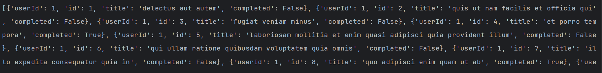

# STEP 1: Create virtual Environment
command: py -m venv .venv
# STEP 2: Activate virtual Environment
command: .venv\Scripts\activate
# STEP 3: Prepare pip
command: py -m pip install --upgrade pip |
         py -m pip --version
# STEP 4: Install requests package
command: py -m pip install requests
# STEP 5: Use Request package
# OUTPUT
